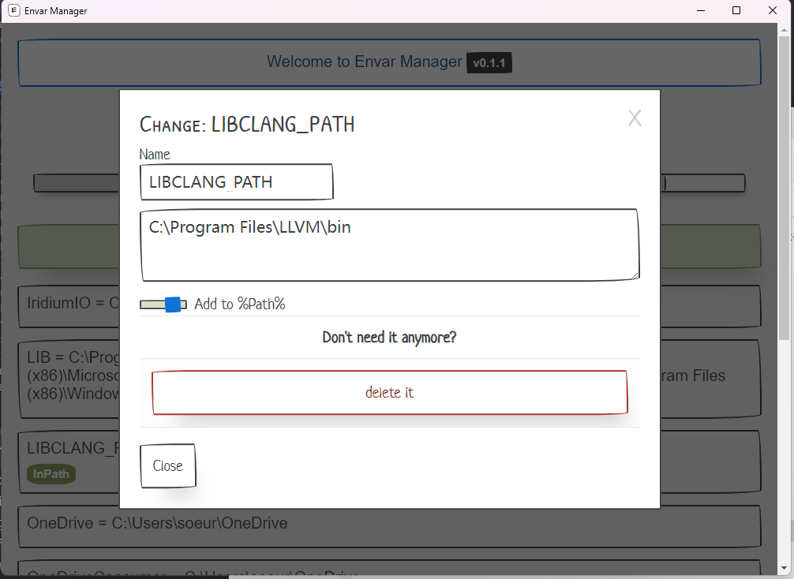

# EnvarManager

A tool for managing environment variables on Windows

一个管理环境变量的工具

It can change existing environment variables (including whether to add to Path):

它可以管理现有的环境变量(包括是否添加到Path):

### System Variables
Administrator privileges are required to manage system environment variables (right click - run as administrator)

需要管理员权限才能管理系统环境变量(右键-以管理员身份运行)

### Platform
Win10 (2018-04+) / Win11

### Based on
- Rust
- Tauri
- `winreg` crate
- svelte
- Spaper (PaperCSS components for Svelte)